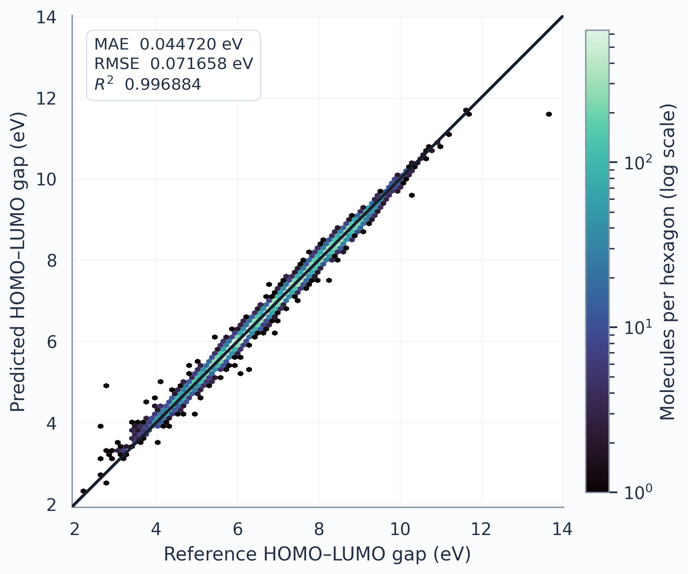
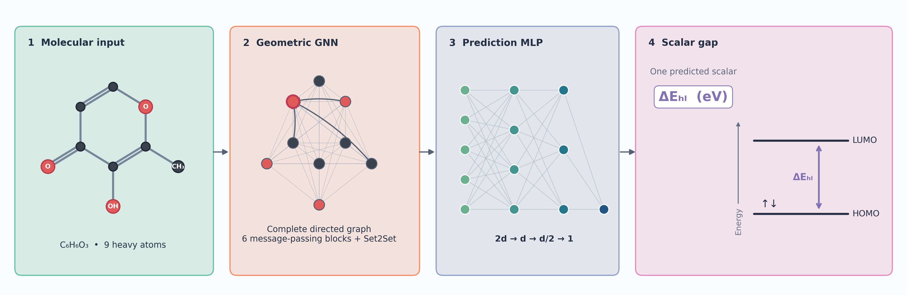
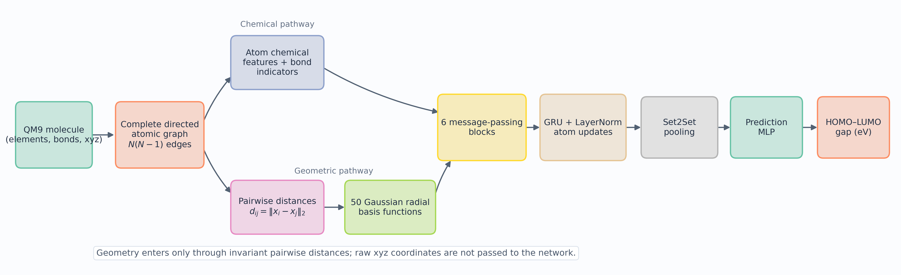
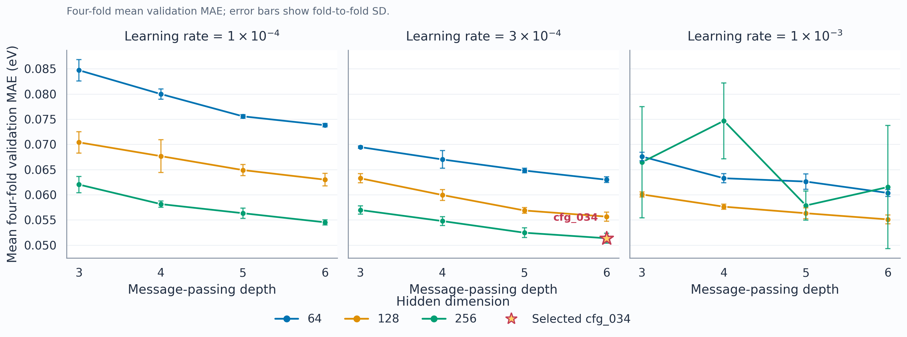
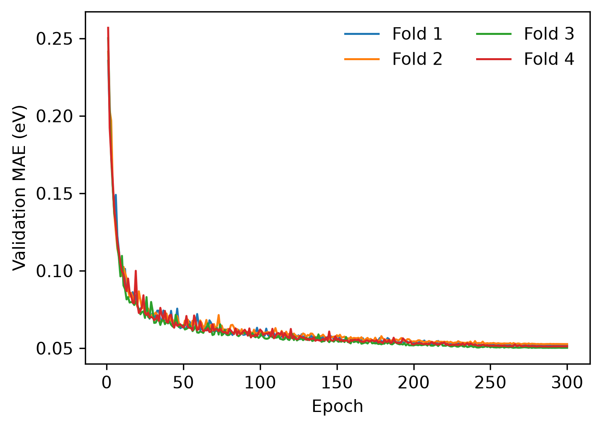
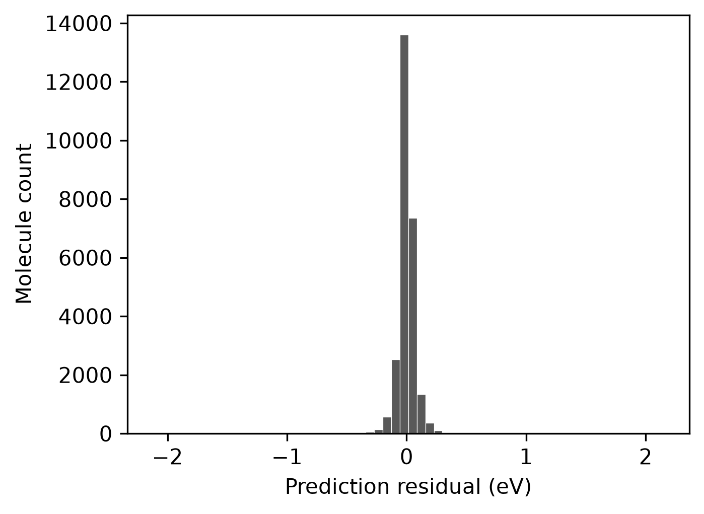
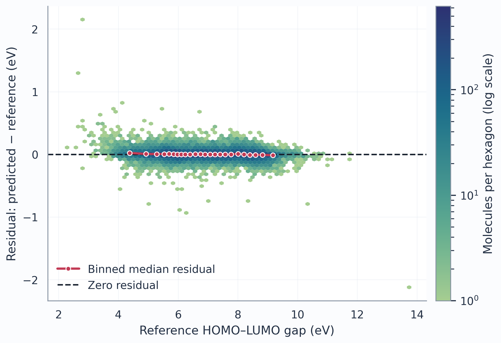

# HOMO–LUMO Gap Prediction in QM9 with a Three-Dimensional Message-Passing Neural Network

## Project overview

This repository implements a reproducible molecular machine learning pipeline for learning a function $f$ that operates on molecular graphs $G$ such that: 

$$
f(G) \longrightarrow \Delta E_{\mathrm{HOMO-LUMO}}.
$$

The model $f$ uses complete directed molecular graphs, distance-based geometric features, gated message passing, and permutation-invariant molecular pooling. 

## Key numbers

> - **Dataset:** 130,831 molecules from QM9 dataset
> - **Training set:** 104,664 molecules (20%)
> - **Final test set:** 26,167 molecules (20%)
> - **Hyperparameter selection:** 36 configurations / 144 four-fold cross-validation (CV) runs
> - **MAE on test set:** 0.044720 eV
> - **RMSE on test set:** 0.071658 eV
> - **R^2 on test set$:** 0.996884

The test set was evaluated once after cross-validation, configuration selection, and fresh training on the complete training set.



*Model predictions for all 26,167 locked test molecules. Hexagon color encodes local molecule count; the diagonal is the identity line.*

## Model in plain language

Each molecule is represented as a graph whose nodes are atoms. Every atom is connected to every other atom in both directions, allowing the model to use the full molecular geometry. Atom descriptors and chemical bond indicators provide chemical context. The equilibrium coordinates are not passed directly to the network: each atomic pair is reduced to its Euclidean distance, and that distance is expanded in 50 Gaussian radial basis functions. Six message-passing blocks iteratively update atom representations using this geometric and chemical context. Set2Set pooling forms a single molecular representation, from which a multilayer perceptron predicts the HOMO–LUMO gap.

## Architecture

### High-level prediction flow



*A representative QM9 molecule is converted to a complete geometric graph, processed by the message-passing network and molecular pooling, and then passed through the prediction MLP. The output of the MLP is the scalar HOMO-LUMO gap, conventionally shown as the gap between the occupied HOMO and unoccupied LUMO levels. See if you can identify this molecule!*

### Detailed feature flow



*Chemical features (atomic number, # of neighbors, hybridization, etc.) and the distance-derived geometric pathway meet in the message-passing blocks. Since geometry is only considered via pairwise distances, raw xyz coordinates of atoms are NOT used to learn $f$.*

## Results and model selection

144 cross-validation runs were completed on the training set. The selected configuration, `cfg_034`, was initialized afresh and trained on all 104,664 development molecules (the entire training sest) for exactly 279 epochs before the single locked-test set evaluation.

### Cross-validation selection

| Quantity | Selected result |
|---|---:|
| Configuration | `cfg_034` |
| Message-passing layers | 6 |
| Hidden dimension | 256 |
| Adam learning rate | $3\times10^{-4}$ |
| Mean four-fold validation MAE | $0.051359 \pm 0.001002$ eV |
| Mean four-fold validation RMSE | 0.086402 eV |
| Mean four-fold validation $R^2$ | 0.995452 |



*The complete 4 × 3 × 3 search over message-passing depth, hidden dimension, and learning rate. Points are four-fold validation means and error bars are fold-to-fold standard deviations.*



*Unsmoothed validation-MAE paths for the four folds of `cfg_034`. Colored markers identify each fold's exact best epoch; the dashed line marks the final training duration of 279 epochs.*

### Locked held-out test

| Quantity | Held-out result |
|---|---:|
| Test molecules | 26,167 |
| MAE | 0.044720 eV |
| RMSE | 0.071658 eV |
| $R^2$ | 0.996884 |

The held-out MAE is 0.006639 eV (12.93%) lower than the mean cross-validation MAE. This comparison is descriptive: cross-validation estimates were used for model selection, whereas the locked test set was reserved for the final evaluation.

| Residual distribution | Residual versus reference gap |
|---|---|
|  |  |

*Residuals are defined as predicted gap minus reference gap. The distribution shows the zero, mean, and median residuals without removing outliers; the residual plot overlays a binned median trend to expose systematic bias.*

## Detailed molecular representation and model equations

### Dataset and target

QM9 contains equilibrium geometries and computed properties for approximately 134,000 small organic molecules containing C, N, O, F, and H. The PyTorch Geometric release retains 130,831 usable structures after excluding uncharacterized entries. Data are downloaded through `torch_geometric.datasets.QM9` and are not committed.

The implementation explicitly asserts that PyG target index 4 is named `gap`. PyG expresses this target in eV. Atomic coordinates and the direct gap target are retained; partial charges, orbital quantities, DFT energies, and target-derived descriptors are excluded from the inputs.

### Complete directed graph and features

Explicit hydrogens remain graph nodes. Each atom is represented by atomic number, degree, formal charge, hybridization, aromaticity, total valence, ring membership, atomic mass, and chiral tag. Atomic number and categorical chemical attributes use learned embeddings followed by a learned projection.

For a molecule with $N$ atoms, the graph contains all $N(N-1)$ directed pairs $(j,i)$, $j\ne i$. No self-edges or distance cutoff are used. Every edge records the Euclidean distance and a seven-component chemical vector: bonded indicator, one-hot single/double/triple/aromatic type, conjugation, and bond-ring membership. Nonbonded chemical vectors are zero.

Distances are expanded in 50 Gaussian functions with centers $\mu_k$ uniformly spaced from 0 to 10 Å:

$$
\phi_k(d)=\exp[-\gamma(d-\mu_k)^2],\qquad
\gamma=(\mu_{k+1}-\mu_k)^{-2}.
$$

Preprocessing records the largest QM9 pairwise distance. A full scan found a 12.040427 Å explicit-hydrogen end-to-end distance in n-nonane, so the base configuration emits an explicit warning when the 10 Å RBF domain is exceeded. The preregistered RBF basis is unchanged, and distances are never cut off or clipped.

### Message passing and molecular readout

At message-passing layer $t$, an edge MLP maps the concatenated RBF and chemical edge representation $z_{ji}$ to a hidden-dimensional filter. A separate linear map transforms the sender state:

$$
m_{ji}^{(t)}=\operatorname{MLP}^{(t)}_{\mathrm{edge}}(z_{ji})
\odot W^{(t)}h_j^{(t)},\qquad
m_i^{(t)}=\sum_{j\ne i}m_{ji}^{(t)}.
$$

Independent parameters are used at every layer. Atom states are updated by

$$
h_i^{(t+1)}=\operatorname{LayerNorm}\left[
\operatorname{GRUCell}^{(t)}(m_i^{(t)},h_i^{(t)})\right].
$$

The recurrent transition has no external residual connection or dropout. Edge MLPs use SiLU and dropout 0.10. Three-step PyG Set2Set performs iterative content-based attention over the unordered final atom states and returns a $2d$-dimensional molecular vector. The prediction head is $2d\to d\to d/2\to1$, with SiLU and dropout 0.10 between linear layers. Its output is a standardized gap.

## Experimental protocol

Seed 42 defines one immutable split of the retained molecules into 80% development and 20% locked final test data. Four deterministic, approximately equal validation folds partition only the development set. Thus each CV run trains on approximately 60% and validates on approximately 20% of all retained QM9 molecules. Every development molecule is a validation example exactly once.

The full preregistered grid contains 36 configurations:

- message-passing depth: 3, 4, 5, or 6;
- hidden dimension: 64, 128, or 256;
- Adam learning rate: $10^{-4}$, $3\times10^{-4}$, or $10^{-3}$.

Four folds give 144 independent runs. Adam minimizes MSE on the standardized training-fold target. Each fold computes its own target mean and population standard deviation from training targets only. Validation predictions are returned to eV for MAE, RMSE, and $R^2$. Cosine annealing is epoch-based. CV uses at most 300 epochs, patience 30, and checkpoint selection by validation MAE in eV.

Selection minimizes mean four-fold validation MAE. Ties are ordered by lower MAE standard deviation, smaller hidden dimension, then fewer layers. The final epoch count is the nearest integer to the median of the four selected-fold best epochs, with half values rounded upward. A fresh model initialized with seed 4242 is trained for exactly this many epochs on all development molecules. It uses target statistics recomputed from the complete development set and no validation-based decision. The test set is accessed only by `scripts/evaluate_test.py`, which requires `--confirm-final-test`.

## Installation and workflows

Python 3.10 or later is required. Install a PyTorch build appropriate for the local CUDA runtime first when necessary, then install the project:

```bash
git clone https://github.com/yashah929/homo-lumo-gap-predictor-3d-gnn.git
cd homo-lumo-gap-predictor-3d-gnn
python -m venv .venv
source .venv/bin/activate
python -m pip install --upgrade pip
python -m pip install -e ".[test]"
pytest
```

CUDA is selected automatically when available. CPU execution supports tests and small experiments.

### Local workflow

The commands below must be run from the repository root.

```bash
python scripts/prepare_data.py --config configs/base.yaml
python scripts/create_splits.py --config configs/base.yaml

# One of the 144 deterministic jobs; indices span 0 through 143.
python scripts/run_cv.py --array-index 0

# Run all jobs locally only if sufficient resources are available.
for i in $(seq 0 143); do python scripts/run_cv.py --array-index "$i"; done

python scripts/summarize_cv.py
python scripts/train_final.py
python scripts/evaluate_test.py --confirm-final-test
```

`scripts/smoke_test.py` performs a three-epoch synthetic CPU run without downloading QM9. It verifies execution, not scientific performance.

Figures can be regenerated independently from the committed result artifacts; this command does not train a model or access the locked test split:

```bash
python scripts/generate_figures.py
```

### SLURM workflow

Cluster scripts contain no institution-specific account, partition, or path. Submit-site options can be supplied to `sbatch`, while project and environment paths are environment variables:

```bash
export PROJECT_DIR=/path/to/homo-lumo-gap-predictor-3d-gnn
export ENV_ACTIVATE=/path/to/environment/bin/activate

python scripts/prepare_data.py
python scripts/create_splits.py
sbatch --account=<account> --partition=<gpu-partition> --gres=gpu:1 slurm/cv_array.sbatch
# After the array completes:
python scripts/summarize_cv.py
sbatch --account=<account> --partition=<gpu-partition> --gres=gpu:1 slurm/train_final.sbatch
sbatch --account=<account> --partition=<gpu-partition> --gres=gpu:1 slurm/evaluate_test.sbatch
```

See `slurm/README.md` for dependencies and submission order.

## Reproducibility

The primary metric is MAE in eV; RMSE and $R^2$ are also reported. `results/cv/cv_results.csv` contains fold-level records, `results/cv/cv_summary.csv` contains configuration aggregates, and `results/final/test_predictions.csv` contains the molecule-level locked-test references, predictions, and residuals used in the diagnostic figures. PNG figures are generated at 300 dpi, with matching PDF versions.

Every run records seeds, complete configuration, split identity, timestamp, hostname, Git commit, Python/PyTorch/PyG/RDKit/CUDA versions, and GPU model. Python, NumPy, PyTorch CPU, and PyTorch CUDA RNGs are seeded. Deterministic algorithms are requested with warnings for unsupported operations. Exact split arrays and SHA-256 hashes are versioned in `splits/`. Checkpoints are stored separately under the configured `artifacts/checkpoints/` root and ignored by Git. Verbose run logs are also ignored; compact summaries, predictions, and figures are commit-ready.

Further details are in `docs/reproducibility.md`; equations and feature definitions are in `docs/methodology.md`.

## References

- Ramakrishnan, R.; Dral, P. O.; Rupp, M.; von Lilienfeld, O. A. “Quantum Chemistry Structures and Properties of 134 Kilo Molecules.” *Scientific Data* **1**, 140022 (2014).
- Gilmer, J.; Schoenholz, S. S.; Riley, P.; Vinyals, O.; Dahl, G. “Neural Message Passing for Quantum Chemistry.” *Proceedings of ICML* (2017).
- Schütt, K. T. et al. “SchNet: A Continuous-filter Convolutional Neural Network for Modeling Quantum Interactions.” *NeurIPS* (2017).
- Sanchez-Lengeling, B. et al. “A Principal Odor Map Unifies Diverse Tasks in Olfactory Perception.” *Science* **381**, 999–1006 (2023).

This is a custom architecture combining complete pairwise geometry, Gaussian radial filters, GRU atom updates, and Set2Set aggregation; it does not claim to reproduce the cited architectures.
